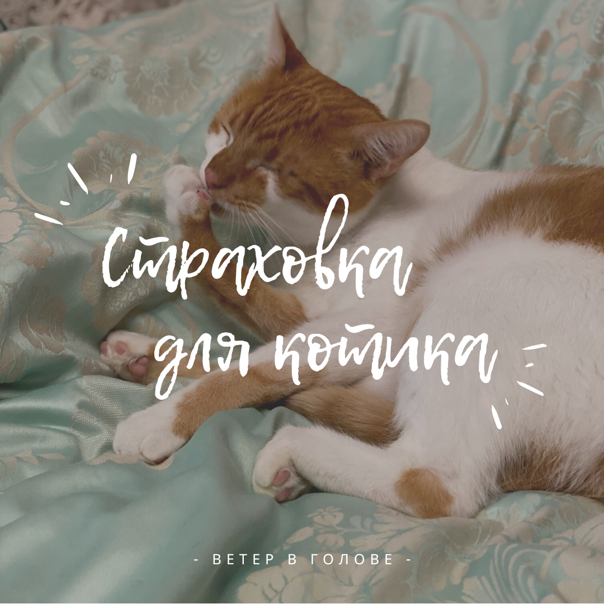

Зачем вообще нужна страховка? Страховка нужна, чтобы когда котик (или пёсель) серьезно заболел вам бы не пришлось вывалить круглую сумму за его лечение. В общем, так же как и с человеком. Только дешевле.

В Нл есть [сайт](https://www.vergelijkdierenverzekering.nl/), где можно сравнить страховки, что покрывают и сколько стоят.

В целом все животные страховки действуют по следующей схеме: подаешь запрос на оформление, ждешь пока одобрят и спишут денег. Далее 30 дней страховка не работает, если у вас раньше не было страховки другой компании. Это сделано для того, чтоб люди не пытались обмануть систему и купить страховку после того, как поняли что им нужно заплатить своей почкой за лечение кота. Всё, что всплывёт у животного **за первые 30 дней** - вы лечите сами, за исключением аварий и возможно каких-то совсем непредвиденных событий.

Далее страховка действует год, оплачивается ежемесячно со счета. Через год можно поменять страховщика или расторгнуть контракт совсем.

На приеме у врача вы оплачиваете всё сами, а затем отправляете запрос на возврат 80% от этой сумму в страховую (80% это стандартная история, никакая страховая не платит полностью), и денежки приходят вам на счет. И итоговая сумма ваших всех 80% от всех походов к врачам, стоимость лекарств, операции - это есть сумма покрытия.

  

Страховку, которую мы в итоге купили очень многие советуют, говорят, что быстро выплачивают и удобно пользоваться сайтом и приложением, а это аргумент! У OHRA базовая страховка стоит 12е и по ней **покрытие на лечение на 2500е** (операции и прочее) и покрытие на осмотры ветеринаром - 100е.  Есть еще Плюс и Тор - вот [тут](https://www.ohra.nl/binaries/content/assets/huisdierenverzekering/vergoedingsoverzicht-huisdieren.pdf) можно посмотреть и сравнить.

И в нее входит: _операции и анестезия, прием и уход в ветеринарной клинике, покупка и установка идентификационного чипа, обследования, такие как УЗИ, рентген, анализы крови, МРТ, лекарства, принудительное и зондовое кормление, медикаментозное лечение опухолей, переливание крови, медицинские изделия, такие как бинты, инсулиновая ручка, ортопедическая обувь, диагностика и лечение всех заболеваний тазобедренного и локтевого суставов, эвтаназия._ В общем много всего, в пределах нашей суммы покрытия - мне кажется, это довольно справедливо по цене за это.

  

Плюс дополнительно за 3е при базовой страховке (чем выше уровень страховки, тем дороже становятся ежемесячные платежи и дополнительные покрытия) мы прикупили **покрытие на вакцинацию и стоматологию** - всё таки это делать нужно и каждый год, да и с зубами бывают довольно часто проблемы у животных.

Среди других дополнительных покрытий есть еще кастрация/стерилизация, кремирование и страховка за границей. Мы пока это брать не будем, но хорошо что такая возможность тоже есть. У каждой из этих доп покрытий есть тоже своя максимальная сумма и что входит. Например, нам при базовой страховке вернут до 50е за вакцинацию/титры, за лечение кариеса до 150е, и также 150е за удаление зубов или лечение каналов. А вот чистка в нашей базовый пакет не входит. Будет сам зубы чистить, нече

  

Если считать как это окупается, то примерно 3-5 похода в год с чем-то не очень серьезным окупят страховку. Мы ходим реже, но у нас и не стоит цели окупить ее, скорее быть спокойными что если вдруг что..

При регистрации в системе страхования спрашивают имя котика и дальше на всех страницах уже обращаются по имени котика - это дополнительная милота (например, “_Выберите опции для Пузика_” и потом письмо с обращением “_Добро пожаловать, Пузик!_”)

Заполняли много разных данных, расу (точнее ее отсутствие), возраст, как долго живет со мной, причины визитов к врачу за последний год, были ли когда-то операции, есть ли хронические болячки.. в конце просят отвечать честно и предупреждает об ответственности за махинации со страховками.

Если надо еще более подробно, то вот [тут контракт и условия](https://www.ohra.nl/binaries/content/assets/polisvoorwaarden/hsd2008.pdf).
