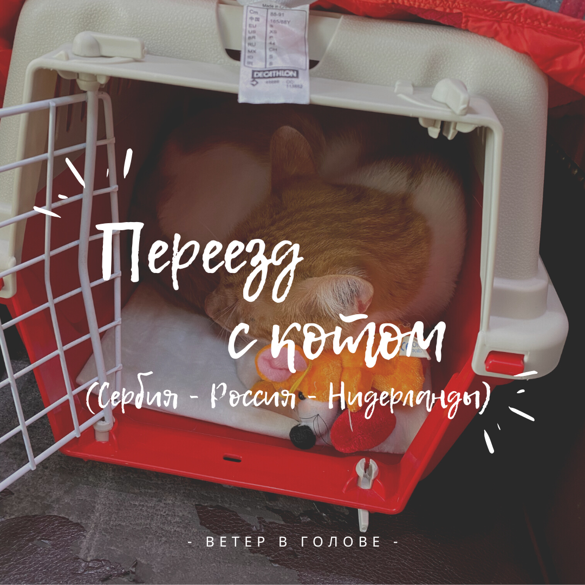

Я решила более подробно описать как я перевозила кота - сначала из Сербии в Россию, потом из России в Нидерланды. Не знаю, будет ли это кому-то интересно, но у меня просто столько впечатлений накопилось, что я просто не могу их оставить при себе. Комментарии приветствуются 😉

Итак, долгожданный переезд.

Здесь рассказываю только о той части переезда, которая связана с котом. Мы начитались истории переезда в Нидерланды от других экспатов и видели посты о сложностях поиска жилья с домашними животными и приняли решение, что котик поживет в России пока мы не найдем квартиру для постоянной аренды, где можно будет жить с питомцами.

  

В принципе, мы уже какое-то время готовились к отъезду из Сербии (куда бы то ни было), так что заранее сделали тест на титры. Просто пошли в нашу ветеринарную клинику в Нови Саде Golub Vet и сдали там кровь. Через 3 недели получили результат там же. Этот тест нужен в некоторые страны, например, Турцию, а действителен до тех пор, пока ты делаешь вовремя вакцинацию, так что мы решили что лишним не будет.

После получения предложения о работе было решено сразу ехать в Россию, поэтому дальше события развивались стремительно. Рейсов прямых из Белграда до Питера тогда еще не было, поэтому пришлось покупать билет Аэрофлота со стыковкой в Москве. Чтобы купить билет и при этом забронировать место для кота (у большинства авиакомпаний на рейсе одновременно может в салоне лететь 1-2 животных), пришлось звонить в колцентр Аэрофлота. Сделали бронь, подождали подтверждения, что на рейс моего кота возьмут, оплатили мой билет. Доплата за кота осуществляется в аэропорту (**75е** за сегмент Белград - Москва и **3750 рублей** за сегмент Москва - Санкт-Петербург - подробнее про цены у Аэрофлота [тут](https://www.aeroflot.ru/ru-ru/information/preparation/luggage#pets-rates)).

  

Начали готовиться к рейсу. Я пошла в **Ministarstvo poljoprivrede - Uprava za Veterinu**, чтобы уточнить, что нам нужно и когда. Там мне сказали, что, чтобы получить международный сертификат на вылет, нужно за 48 часов сделать _регулярный осмотр у ветеринара_, с занесением отметок об этом в паспорт. И с _паспортом, чипом, оплатой_(две уплатницы 4020rsd и еще 200rsd) и _заполненным заявлением_ прийти к ним.

Так и сделали, за 2 дня до вылета поехали с котом к ветеринару на осмотр, проглистогонили котика и поставили лекарства от наружных паразитов.

  

Сразу же поехали в министерство сельского хозяйства. Передо мной вышел мужчина с сертификатом, я постучала и зашла. Женщина только открыла рот, чтобы откусить свою плескавицу. Я спросила можно ли мне получить сертификат для вылета? Она сидела и жевала, попросила подождать в коридоре. Время было 10 часов утра, самое время для плескавицы, так что я покорно ждала, кот тоже.

Она вышла через 5 минут. Сначала вздыхая спросила «ну давайте, что у вас там есть посмотрим», я выдала ей всё, что было нужно, она очень этому удивилась, сказала “ого, у вас всё есть, сейчас сделаю!”. Спросила зачем я приехала с котом. Я очень растерялась, ведь до этого меня консультировал другой сотрудник и я была уверена, что кот нужен. В общем, она ушла, я осталась в недоумении оправдываться перед котом зачем я его сюда притащила. Она вышла еще через пару минут и спросила куда мы летим, и что ей нужно указать все наши места назначения (у нас была пересадка в Москве, конечный пункт - Санкт-Петербург) и еще через несколько минут она вышла и вручила нам сертификат. Всё прошло очень быстро и дружелюбно, даже не смотря на то, что я отвлекла ее от плескавицы.

Котик у меня пережил 5 переездов внутри Нови Сада, что довольно много даже для человека, не говоря уже о маленьком животном. Поэтому любые выходы из дома у него сопровождаются сильным стрессом. Зная это, я сильно переживала как пройдет перелет, тем более два перелета со стыковкой! Вся дорога от дома в Нови Саде до аэропорта и аэропорта дома в Питере занимала больше 12 часов. Знакомые посоветовали мне лекарство, которое дают людям с эпилепсией. Я проконсультировалась с ветеринаром, мне подогнали таблетки (они только по рецепту) и рассчитали правильную дозировку. За два дня до вылета, как раз когда мы ездили к женщине с плескавицей (читай пост выше), я решила протестировать как подействует на него лекарство - станет ли он спокойнее. Там есть разные степени действия, либо котику пофиг все что происходит, либо он спит. В общем, я дала слишком маленькую дозировку и он орал в такси. Отходняка не было, так что решили просто дать побольше. Действие должно было пройти за 6 часов, так что когда мы вернулись с сертификатом на вылет, котик лег на любимое место, успокоился и проспал часов 5 не вставая.

  

В день вылета. Мы приехали в аэропорт и на парковке дали коту лекарство. Дальше прошли на регистрацию, взвесили переноску (никто не мерил габариты, но мы проходили по размерам точно), пошли оплачивать билет для кота. Там еще и не принимают оплату картой или в евро, бегали искали банкомат, но это отдельный прикол белградского аэропорта. Вернулись на регистрацию, получила два посадочных для себя, но для кота оплатить попросили только один сегмент - странно. Мы зашли в гейт почти самые первые и это хорошо, потому что вначале не было толкучки. После прохода через рамку Пузик радостно залез в переноску и сидел более менее тихо. По мере набивания народа ему это начало надоедать, он начал все чаще орать. В какой-то момент он просто начал царапать дверцу и вцепился в нее зубами - я думала он их сломает об прутья. Я начала переставлять вокруг себя переноску , чтоб отвлечь его от побега.

  

В самолете попросили поставить переноску между ног, точнее под сидение спереди. И хоть наша переноска подходит по габаритам, она туда не пролезла целиком. Мы сели, он вроде поутих вплоть до того как мы начали набирать скорость для взлета. В этом момент в нем опять проснулся дьявол, я очень переживала выдержит ли переноска вообще это. Он бился как ненормальный, я совала ему пальцы в дверцу, чтоб его отвлечь, но ему было пофиг на них. Он так минут 5 переживал, потом просто немножко мявкал, а потом сидел жалобно на меня смотрел. Через полчаса он повернулся ко мне попой, и сидел смотрел вперед. Я видела, что его клонит в сон, закрыла окошко, думала уснет. Он развернулся обратно и сидел как заколдованный, только уши дергались. За час-полчаса до посадки я задремала, проснулась от того, что он заорал, и в этот же момент услышала, что мы начинаем готовиться к посадке - видимо он почувствовал. Сильно орать и копать клетку начал уже только тогда, когда колеса коснулись земли.

В Шереметьево меня встречала подруга, которая работает бортпроводником в Аэрофлоте, спасибо ей большое. Я тогда была немножко в панике.

Вышли из самолета и пошли на выход, через багаж и зеленый коридор, никто даже не обращал внимание, что я с котом. В зеленом коридоре я даже уточнила - мне не надо вет контроль? Сказали типо «идите уже». Подруга встретила нас и отвела на **ветконтроль**. Пришли мы такие красивые, говорим, что прилетели из Сербии, проверьте нас. Даю паспорт, сертификат. Работник спрашивает “_а куда вам штамп ставить?_” Неожиданный вопрос. Говорю, что не знаю и в целом мне все равно. Поставил прямо в паспорт. На клетку даже не посмотрел. _Из Сербии в Россию никто ни разу не проверял чип и не смотрел животное_, хоть редкого животного провози. _В Сербии даже паспорт не смотрели_. Ну вы поняли. Зачем я справку делала? Я ее ни разу даже из рюкзака не достала за весь день. Только зря помешала женщине плескавицу есть.

Пошли на стойку информации, там оплатили второй сегмент перелета для животного, сказали опять идти на стойку регистрации. Уф.. идем, там толпы народу, на полчаса очередь точно. Благо попался добрый работник аэропорта, провел нас в “Специальный сервис”, я объяснила ему, что у нас уже и посадочный есть, и кот проверен и оплачен. Что мне сделали на стойке - наклеили новую бирку на переноску и все.

Попили кофе, коту принесли воды - не захотел.

Пошли на самолет, опять контроли. Из переноски котика доставала как желе. Мы прошли, меня еще попросили кота отодвинуть от туловища, чтоб меня осмотрели, не проношу ли я там чего вместе с котом. Потом его еще каким-то пылесосом просканировали. Уже не мяукал, было видно что устал и перенервничал, хотел спать, но не мог. На этом рейсе я также поставила переноску под сидение, но бортпроводники попросили пристегнуть к себе переноску, потому что она не проходит полностью под сидение.

Этот взлет и посадку прошли уже спокойнее. В Пулково опять кота никто не замечал, на ветконтроль тут мы уже не пошли. Мы доехали до дома на такси, котик орал, видимо немножко отдохнул на последнем рейсе. И в Питере он уже остался окультуриться на 4 месяца.

Тем временем мы в Амстердаме искали квартиру, где бы можно было жить в животными. Ожидая трудностей, мы были весьма удивлены тому, что многие спокойной сдают квартиры людям с котом, даже меблированные. Один из агентов даже сказал “_А у кого сейчас нет кота? Это же не 3 собаки, так что всё нормально_”. В общем, мы довольно легко нашли квартиру (решили всё таки взять без мебели, но с полами).

После того как я перевезла вещи из Сербии (это была отдельная эпопея), я поехала в Россию за котом.

У нас были в порядке все документы (чип на месте, паспорт (сербский) в порядке и все прививки в наличии). Поэтому нас оставалось только оформить справку в государственной ветлечебнице формы №1 и обменять ее в аэропорту на международный сертификат.

По прилету в Питер меня встречала мама и она “на радостях” потянула меня в ветконтроль со словами “я всё узнала, пошли они тебе всё расскажут, что надо делать”.

  

В закаулках аэропорта Пулково находится комната ветконтроля, рядом с ней стояла женщина с переноской. И вот я подхожу к кабинету, сотрудники узнают меня по маме (потому что она только что у них была) и начинается примерно следующе диалог с дядечкой в погонах.

_⁃ Вы должны приехать к нам, в аэропорт за сутки до вылета, с животным._

_⁃ Зачем? У меня уже все документы есть, мы уже летели с котом из Сербии, у кота есть паспорт._

_⁃ Сербский паспорт не подойдет._

_⁃ В смысле не подойдет?! Мы с ним летели из Москвы в Питер по этому паспорту и всё было нормально. Мне в Шереметьево его проверяли в ветконтроле и штамп в него поставили!_

_⁃ У них там в Шереметьево всё неправильно, а мы тут делаем правильно. Ладно, паспорт ваш подойдет. Но вам все равно надо приехать заранее, чтобы мы всё проверили._

_⁃ Что проверили? Зачем мне ехать с животным?!_

_⁃ Мы будем сверять чип на нем. Если у вас в справке из ветлечебницы будут какие-то ошибки  - вы не сможете улететь с животным. Вон одна дама уже сидит, ей сделали ошибку в справке и никто уже ей не исправит, потому что воскресенье. (Указывает на женщину в коридоре)_

_⁃ А можно как-то_, _чтоб ветлечебница сразу без ошибок сделала?_

_⁃ Ну откуда я знаю. Но вы не переживайте, если будет ошибка, вы им позвоните, они в системе всё поправят и вам даже ехать к ним не надо будет второй раз._

_⁃ Тогда зачем мне к вам приезжать за сутки?! Давайте я приеду в день вылета и если что, они сразу мне поправят?_

_⁃ Нет. Приезжайте заранее, а то мало ли.. может они заняты в этот момент будут или на обеде._

… Дальше я просто психанула, развернулась и ушла со словами “Я пока не готова в этому деланию мозгов, я только приехала в Россию”

  

Что было дальше? За день до вылета мы поехали в ветслужбу делать справку. Пока стояла в очереди на стойке регистрации, я увидела объявление со списком документов, необходимых для нашей справки. Это бумажка повергла меня в приступ ярости, потому что там был список необходимых документов, и среди них: **Ветеринарные требования страны-импортера для перевозки животных, переведенные на русский язык, распечатанные (можно из интернета) в двух экземплярах. БЕЗ ТРЕБОВАНИЙ СТРАНЫ-ИМПОРТЕРА СПРАВКА НЕ ВЫДАЕТСЯ.** (Форматирование текста как в бумажке). Ну не идиоты ли там сидят? То есть они в интернете не могут это посмотреть, мне надо им перевести и распечатать (в 2х экземплярах!!!). Я уже морально готовилась, что буду прям при них звонить в Россельхознадзор, чтобы они мне там сказали, на каких основаниях мне не выдают справку. Но всё обошлось, о требованиях страны меня даже не спросили.

  

Дальше мы пошли в кабинет к врачу, отстояли еще часа полтора в другой очереди и зашли за 10 минут до обеда (первый раз вижу, чтобы ветеринар работал с обедом) и без особых вопросов нам сделали справку. Кстати, эту справку выписывают на ваш маршрут от ветклиники до места, где вы будете обменивать его на международный, в Питере это **либо Пулково, либо Морской вокзал, либо Финляндский**. Была мысль поехать на вокзал, потому что это ближе, но я подумала на всякий случай не отклоняться от плана и в справке указать Пулково. Это было правильно, хотя бы потому, что нам всё равно нужно было бы идти в ветконтоль в аэропорту, чтобы получить посадочный талон для животного и уже с ним идти на регистрацию.

После получения справки мы поехали в Пулково. Подходим к кабинету, девушка с погонами “_Здравствуйте, мы вас помним_”(об этом писала в предыдущей части). Отвечаю, что я их помню тоже и что вылетаю завтра. Проверяет чип, берет справку, через 10 минут выдает сертификат и говорит, чтоб завтра мы сразу шли на регистрацию, а затем в красный коридор на таможне. Я удивляюсь, что надо идти красным коридором с котом, который не представляет материальной ценности и спрашиваю почему не зеленым? В ответ получаю ведро желчи во взгляде и ответ “_вот они там вам и расскажут, можете прямо сейчас к ним пойти_”. Почему я не могла сделать это в день вылета и катать почти 3 часа по городу бедное животное - останется загадкой.

  

Когда я покупала билет Спб-Амс-Спб, я сразу посмотрела требования по перевозке животного в салоне, а точнее габариты переноски. У KLM это - [46 x 28 x 24](https://cuba.klm.com/information/pets/reservation). (Кстати у них на сайте даже [чеклист](https://cuba.klm.com/information/pets/preparation) для путешествия с животными есть). После долгих размышлений, я приняла решение, что 1 см не должен стать проблемой (наша переноска 25 см).

Вечером перед вылетом приходит смска от авиакомпании, чтобы мы **проверили высоту нашей переноски**. После этой смски я немного начала нервничать и думать, а не мотнуться ли утром за новой переноской, но я так замучалась с этими документами, что решила рискнуть.

  

В день вылета. Котику одеваем **ошейник с ферамонами**, ему становится спокойнее. В такси почти не орет.

На стойке регистрации ставлю переноску, смотрят вес. Девушка, которая нас оформляла, советуется с коллегой - “_да вроде маленькая переноска?_”, но коллега предлагает померить переноску всё таки. Пока они ищут рулетку, я чувствую как паника накатывает на меня. Они прикладывают рулетку, вроде 24, но не точно, поэтому берут листик, кладут на верх переноски, замеряют опять - 25 см. Значит, больше чем нужно. Говорю, что уже летели с этой переноской и она нормально влезла под кресло, хоть и не полностью. Но не KLM, а Аэрофлот. В общем, девушки разрешили мне пройти с переноской, но посоветовали купить всё таки гибкую переноску, предупредили, что AirFrance не пустил бы нас. Фух.

Идем на таможню, **красный коридор**. На столиках рядом со входом разложены декларации и образцы, как их заполнять. Декларации на английском, образцы на русском. Странно. Но черт с ним, тут всё странно. Заполнила, данные моего паспорта, данные из сертификата кота, номер чипа и номер сертификата. Иду на вход, меня просят подождать, потому что из зеленого коридора пригласил толпу народа, которых по одному теперь досматривают. Стоим ждем, фоткаемся с мамой, нам даже предложили сесть на кресло. Кроме меня больше никого. Даже хорошее настроение - ведь нас пропустили с переноской и вообще никаких сложностей не возникло.

Сотрудница из красного коридора спрашивает, когда мой рейс, не спешу ли я и могу ли подождать. Я говорю какой рейс, она говорит, что времени полно поэтому “_стойте ждите_”. Я начинаю немного напрягаться - зная их, вот такие вопросы не к добру. И так, ребята проходят, наступает наш черед. Захожу, протягиваю декларацию. Вторая сотрудница берет наши документы, начинает их ксерокопировать. Проверяет чип у котика. Приходит сотрудница “еще полно времени”, берет декларацию…

_⁃ А почему вы латиницей заполнили?_

_⁃ Так если вопросы на латиницу, то и ответы, наверное, ожидаются на латинице?_

_⁃ Там есть бланки на-русском._

_⁃ Я не нашла, только такие увидела. А это проблема? Я же данные переписывала с паспорта и сертификата, они там тоже на латинице_.

_⁃ У вас гражданство русское? Вы русская? Вот и пишите на русском. Не вижу смысла вам писать на английском._

_⁃ … Ну если надо, я могу заполнить заново._

_⁃ Вот вам бланк, выходите и там заполняйте._

  

Выхожу (всё это я делаю с рюкзаком, чемоданом и переноской с котом). Заполняю бланк еще раз и иду обратно. Только захожу, сотрудница “еще полно времени”, не поднимая глаз, спрашивает **“Кто разрешил вам заходить? Вы не видите, я занята?!”** Смотрит на меня - “А, это вы. Заполнили? А ваши документы уже откопировали?” Говорю, что вроде ее коллега вроде всё уже скопировала. Она звонит коллеге, с умным лицом сидит и ждет пока та возьмёт трубку, в тоже время рядом с ней начинает звонить телефон. Так продолжалось минуту, потом до нее доходит, что телефон та оставила на рабочем месте и ушла. Говорит, что наверное всё готово, забирает декларацию и пропускает нас на рейс, пожелав хорошего пути.

Занавес. Наверное, будь я хорошим комиком, это было бы отличный повод для выступления, я просто сама читаю и в шоке с того что это всё проходило одновременно. Анекдот какой-то.

  

Полет прошел спокойно, рейс был полупустой, поэтому у Пузика было своё кресло. Я на посадке приоткрыла клетку и держала его за лапу, поэтому ему было не так тревожно.

Вышли в Скипхоле. Сразу иду к красному коридору, сотрудница попросила паспорт кота, сертификат и дала мне аппаратик, чтоб я сама проскандировала чип, чтоб котика не вынимать из переноски. Дальше она что-то проверяла по сертификату и паспорту. Представляю ее удивление, паспорт кота из Сербии, половина вакцин стоит оттуда, половина из России. Спросила лишь чей кот и живем ли мы тут. И всё, мы отправились домой. Сели в метро, прокатились немножко по городу, прошлись пешком до дома и вот Пузик уже житель Амстердама!

_Хэпи энд_